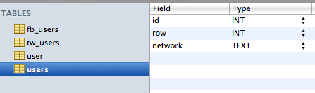

# postFlo

### A simple workflow for getting permission to post to users social profiles + a simple workflow to post to all the users profiles.

## Send posts to users

## Notes

    postFlo consists of two pieces: a user permission gathering system and a user posting system.

### Permission Gathering System

** On the Facebook side of things: **

*   Create a new Facebook application
*   Create a new authorization URL based on our requested permissions: _offline_access_ and _publish_stream_
*   Present the user this URL in the form of a pretty button
*   When the button is clicked, the standard Facebook App log in & authorization pages appear
*   The user fills them out and grants us access
*   Facebook passes some tokens to our nifty redirect_uri; we call it _fbCallback.php_
*   fbCallback.php takes the users access tokens and saves it to a table called _'fb_users'_; an example row is:

*   id = 7, user_id = 753842370, name = John Smith, access_token = AAAEoiZBzvqZAcBAN1vpoekfwoiejfoiwejfoiwejfoiwjef6*   fbCallback.php inserts _id_ as 'row' into into a table called _'users'_ along with their network (fb)
** On the Twitter side of things: **

*   Create a new Twitter object
*   Create a new authorization url based on our app's _consumer key_ and </i>consumer secret</i>
*   Present the user this URL in the form of a pretty button
*   When the button is clicked, the standard Twitter App log in & authorization pages appear
*   The user fills them out and grants us access
*   Facebook passes some tokens to our nifty callback url; we call it _twCallback.php_
*   fbCallback.php takes the users access tokens and saves it to a table called _'fb_users'_; an example row is:

*   id = 7, user_id = 422382022, screen_name = CreatechConsult, profile_image_url = http://imagepath.jpg, oauth_token = longToken, oauth_token_secret = longTokenSecret,*   twCallback.php also inserts the user into a table called _'users'_ along with their network (tw)

    The reason we have a seperate table called 'users' is so that we can easily call both the Twitter and Facebook users in other places, like admin.php.

    Overview of the tables:

*   fb_users
*   tw_users
*   users

### Posting System

    You (the admin) visits [admin.php](admin.php). You fill it out, and then the admin.php sends data over to notify.php. Notify.php does the dirty work of actually sending the users the notifications.

**admin.php**

*   Is just a form that sends data to notify.php via POST
*   Uses /lib/login for security
*   Pulls users from the _'users'_ table
*   Sets up a new Facebook and Twitter object
*   If they are from Facebook, it pulls their info from the _'fb_users'_ table
*   If they are from Twitter, it pulls their info from the _'tw_users'_ table
**notify.php**

*   Uses POST to get the data from admin.php
*   Goes through the user list that is passed, determines which table they are in, and then runs the appropriate post function: postToTW.php or postToFB.php
**postToTW.php**

*   Sets up a Twitter object that posts using the passed tokens and message to Twitter
*   Returns a success or fail message
*   Uses /lib/twitter
**postToFB.php**

*   Sets up a Facebook object that posts using the passed tokens and message to Facebook
*   Returns a success or fail message
*   Uses /lib/facebook

### Settings

**Settings are stored in:**

*   config.php - houses the database connection settings, twitter settings, and facebook settings
*   Facebook App - The canvas url of our app

*   You  specify the callback uri within the code, redirect_uri*   Twitter App - The url of our app, the callback URL, the permissions we need, and such

### Requirements

*   **/lib/facebook** - v3 of the Facebook PHP SDK
*   **/lib/twitter** - uses twitter-async, from https://github.com/jmathai/twitter-async
*   **/lib/klout** - custom written, super simple
*   **/lib/login** - uses PHP Login Script, from https://github.com/sonusandhu/PHP-Login-Script
